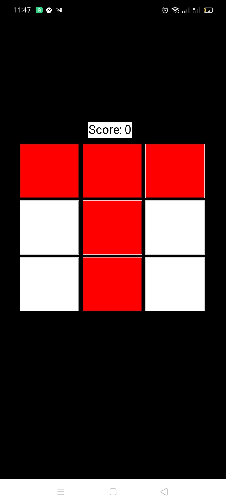

# ColorTap

ColorTap is a simple and addictive game built with Python and the tkinter library. The objective of the game is to tap on red-colored buttons to turn them white and increase your score. Can you clear all the red buttons and achieve a high score?

## Features

- Simple and intuitive gameplay.
- Randomly generated red and white buttons for each round.
- Keep track of your score and aim for a high score.
- Easy-to-understand restart mechanism.
- Addictive fun for all ages!

## Screenshots

## How to Play

1. Clone this repository to your local machine.
2. Make sure you have Python installed.
3. Run the `colortap.py` script to start the game.
4. Click on the red buttons to turn them white and increase your score.
5. Try to clear all the red buttons to advance to the next round.
6. Enjoy the challenge and have fun!

## License

This project is licensed under the MIT License - see the [LICENSE](LICENSE) file for details.

## Acknowledgments

- Built with Python and tkinter.
- Inspired by simple tap games.
- Special thanks to the open-source community for various contributions.

Feel free to contribute, report issues, or provide feedback. Have fun playing ColorTap!
